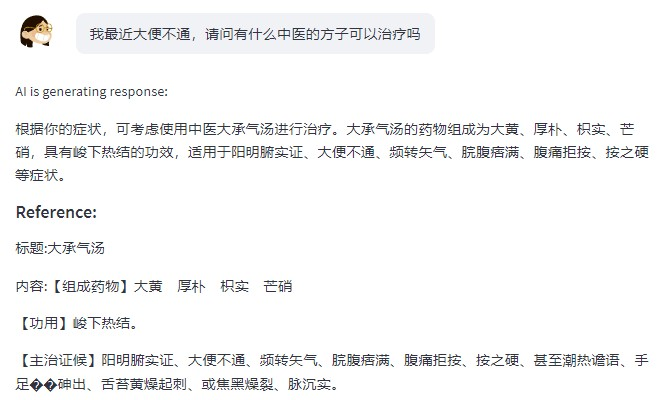
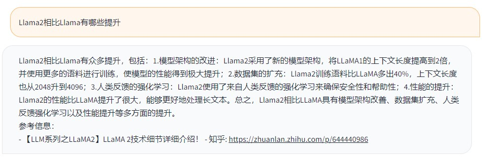

[**中文**](./README.md) | [**English**](./README_EN.md)


## 介绍
以ChatGPT、ChatGLM、Llama等为代表的大语言模型（Large Language Model, LLM）在各种自然语言任务取得了惊人的表现。但是大模型仍然有很多明显的缺陷：(1)如果直接使用大模型进行知识问答，知识以参数的形式隐式地存储在模型中，我们不能保证模型输出答案的准确性，也不能实时地更新知识; (2)LLM存在的幻觉问题，对于一些他无法回答的问题，他也能"一本正经地胡说八道", 使得其生成的答案的可信度较低。

为此，我们现推出**ChatWK**框架，其在[REAT-LLM](https://github.com/RUC-GSAI/YuLan-IR/tree/main/RETA-LLM)的基础上进行了一系列的改进和扩充，具备以下功能:
- 🚀 支持ChatGPT、Chatglm、Chatglm2、Llama等模型的使用。
- 🚀 支持构建本地知识库(类似langchain)或者使用bing search api获取外部知识，为模型的回答提供参考材料，减少幻觉问题。
- 🚀 检索本地知识库时支持使用稀疏索引和稠密索引两种方式。
- 🚀 采用我们构造的数据对开源大模型进行针对性的微调，使其能够更有效的在文档中选中回答问题需要的内容，同时也具备更好的对参考材料进行总结回答的能力。

于此同时，我们还开源了相关的数据集和模型，便于用户在本地快速构建属于自己的知识问答机器人（量化之后10G显存即可使用）。
- 🚀 开源[WebCPM_WK](https://huggingface.co/datasets/ZHR123/WebCPM_WK)数据集。我们对WebCPM中的pipeline数据进行了二次处理，构建了WebCPM_WK数据集。该数据集主要的目的是提高模型的两个能力：1.给定问题和文档，能够抽取文档中与问题相关知识的能力。2.给定参考材料和问题，能够根据参考材料回答问题的能力。
- 🚀 开源[Chatglm2_WK](https://huggingface.co/ZHR123/Chatglm2_WK)模型。该模型是以Chatglm2-6B为主干，采用Lora高效参数微调方法，基于[WebCPM_WK](https://huggingface.co/datasets/ZHR123/WebCPM_WK)数据集进行微调后的模型。


## 快速上手

### 环境配置
```bash
 cd ChatWK
 conda env create -f environment.yaml
 conda activate ChatWK
 pip install peft==0.3.0
 pip install adapter-transformers --force-reinstall
 pip install transformers==4.28.0 --force-reinstall
 git clone https://github.com/adapter-hub/adapter-transformers.git  
 mv adapter-transformers adaptertransformers
```

### 参数配置
在`system/config.py`中配置要使用的模型和知识引入方式。如果是使用ChatGPT和[bing search api](https://www.microsoft.com/en-us/bing/apis/bing-web-search-api)则需要填入对应的密钥。

### 构建Chatglm2_WK模型(可选)
1. 获取[Chatglm2](https://huggingface.co/THUDM/chatglm2-6b)基座模型的参数和[Chatglm2_WK](https://huggingface.co/ZHR123/Chatglm2_WK)的lora参数。
2. 将两者合并，构成完整的Chatglm2_WK模型：
```
  python merge_lora.py --lora_path ../chatglm2-lora \
  --base_path ../chatglm-6b \
  --output_path ../chatglm-6b-merged
```
### 构建本地知识库(可选)
1. 将要使用的本地知识以json文件的形式存储到`json_data`文件夹中，数据格式如`json_data/1.json`所示。
2. 构建本地知识库的faiss索引,便于后续检索。
```
   cd indexer
   python index_pipeline.py --index_type all  --data_dir ../json_data  --index_save_dir ../index --batch_size 128 --use_content_type all --train_dam_flag --language zh
   cd ..
```
   - `--use_content_type`：使用文档中的哪一个字段构建，可选项包括：title, contents, embed_keys, all。
   -  `--train_dam_flag`：基于本地知识库，重新训练嵌入模型。如果删除本项，则在`system/config.py`配置文件中将`DAM_NAME` 设置为hugging face上开源的模型名字，或本地模型的路径。

### 部署demo
本项目可以部署两种不同的demo:
1. 使用streamlit部署demo
```
   cd system
   streamlit run web_demo.py --server.port 1241
```
2. 使用gradio部署demo
 ```
   cd system
   python demo_gradio.py
```


## 示例
### 基于本地知识库进行回答

### 基于bing search搜索的内容进行回答



## 致谢

本项目基于开源项目进行开发，在此对相关项目和研究开发人员表示感谢。

- [Reta-LLM](https://github.com/RUC-GSAI/YuLan-IR/tree/main/RETA-LLM)
- [WebCPM](https://github.com/thunlp/WebCPM)
- [ChatGLM2-6B](https://github.com/THUDM/ChatGLM2-6B)


## Citation
如果你使用了本项目的模型，数据或者代码，请声明引用：

```bash
@misc{zheng2023ChatWK,
      title={ChatWK: Chat with Knowledge}, 
      author={Zheng Huanran},
      year={2023},
      publisher = {GitHub},
      journal = {GitHub repository},
      howpublished = {https://github.com/boom-R123/ChatWK},
}

```


